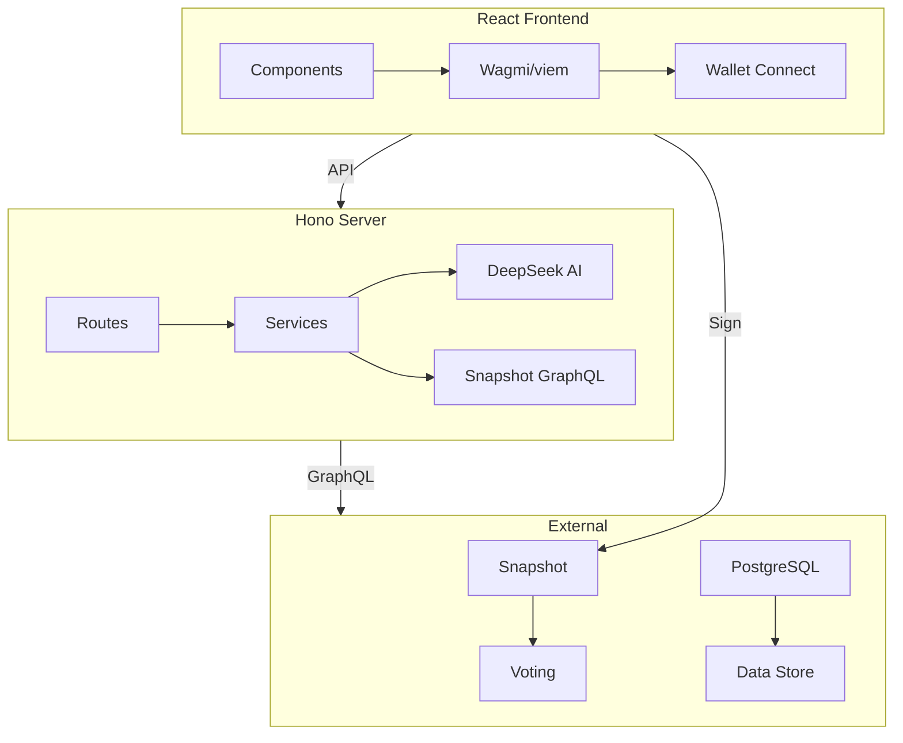

<div align="center">

# VoteNow
> 多链 DAO 治理聚合器 · Multi-chain DAO Governance Aggregator


真实 Snapshot 投票 · AI 提案分析 · 积分奖励系统

__简体中文__ | [English](./README_EN.md)

---
</div>

## 项目简介

**VoteNow** 是一个多链 DAO 治理聚合平台，聚合了以太坊、Arbitrum、Optimism、Polygon 等 20+ DAO 的治理提案。用户连接钱包后，可以查看 AI 辅助分析的提案，通过 MetaMask 进行真实的 Snapshot 投票（EIP-712 签名），并获得可兑换奖励的积分。

## 🌟 核心功能

### 1. 🗳️ 真实 Snapshot 投票
- **EIP-712 签名**：通过 MetaMask 进行链下投票
- **真实投票权重**：实时查询用户的投票权重
- **重复投票检测**：自动检测已投票提案

### 2. 🤖 AI 提案分析
- **DeepSeek 驱动**：智能风险分析
- **策略一致性评分**：评估提案与项目目标的一致性
- **投票建议**：AI 提供投票参考建议

### 3. 🏆 积分与奖励系统
- **投票获得积分**：根据 DAO 层级获得 40-100 积分
- **早鸟奖励**：24 小时内投票额外 20% 加成
- **6 级排名系统**：从新手到 DAO 传奇
- **奖励商城**：积分兑换实物奖励

### 4. ⛓️ 多链支持
- Ethereum
- Arbitrum
- Optimism
- Polygon
- 支持按链筛选

### 5. 🏛️ 20+ DAO 集成
Aave, Uniswap, Curve, Compound, Arbitrum DAO, Optimism, Lido, ENS, Safe, Gitcoin 等

### 6. 📊 其他功能
- **排行榜**：顶级投票者排名
- **Telegram 机器人**：新提案推送通知
- **AI 对话**：就提案内容与 Agent 交流

## 📸 界面预览

| 仪表盘 | 提案详情 | 投票面板 |
|:---:|:---:|:---:|
|  |  |  |

| 排行榜 | 奖励商城 | AI 分析 |
|:---:|:---:|:---:|
|  |  |  |

## 🏗️ 技术架构



## 🛠️ 技术栈

| 层级 | 技术 |
|------|------|
| **前端** | React 19, Vite 6, Tailwind CSS, Recharts |
| **Web3** | wagmi 2, viem 2, ethers 5, @snapshot-labs/snapshot.js |
| **后端** | Hono, Node.js, TypeScript |
| **AI** | DeepSeek (OpenAI SDK) |
| **机器人** | grammy (Telegram) |
| **测试** | Vitest (75 个测试) |

## 📁 目录结构

```
votenow/
├── frontend/                # React 前端
│   ├── components/         # 13 个组件
│   │   ├── Dashboard.tsx        # 主视图
│   │   ├── ProposalDetail.tsx   # 提案详情
│   │   ├── VoteButton.tsx       # 投票按钮
│   │   ├── PointsPanel.tsx      # 积分面板
│   │   ├── Leaderboard.tsx      # 排行榜
│   │   └── RewardsShop.tsx      # 奖励商城
│   ├── hooks/
│   │   ├── useSnapshotVote.ts   # 投票 Hook
│   │   ├── useProposals.ts      # 提案获取
│   │   └── useWallet.ts         # 钱包配置
│   └── services/
│       ├── api.ts               # API 客户端
│       └── snapshot.ts          # Snapshot SDK
│
├── server/                   # Hono 后端
│   ├── src/
│   │   ├── routes/        # 8 个路由模块，42+ 端点
│   │   ├── services/      # 10 个业务模块
│   │   │   ├── dao-manager.ts   # DAO 管理
│   │   │   ├── snapshot.ts      # Snapshot 集成
│   │   │   ├── llm.ts           # AI 分析
│   │   │   ├── points.ts        # 积分计算
│   │   │   └── voting.ts        # 投票权重
│   │   └── __tests__/     # 75 个测试
│   └── package.json
│
├── docs/                     # 详细文档
│   ├── api-reference.md
│   ├── deployment.md
│   └── implementation-status.md
│
└── skills/
    └── dao-governance/      # Agent 技能定义
```

## 🚀 快速开始

### 安装

```bash
# 克隆仓库
git clone https://github.com/your-username/votenow.git
cd votenow

# 安装依赖
npm install

# 配置环境变量
cp .env.example .env
# 编辑 .env 填入 API Keys
```

### 环境变量

```env
DEEPSEEK_API_KEY=       # 必填 — AI 分析
TELEGRAM_BOT_TOKEN=     # 可选 — Telegram 通知
PORT=3001               # 服务器端口
FRONTEND_URL=http://localhost:3000
```

### 运行

```bash
# 同时启动前端和后端
npm run dev

# 或分别启动
npm run dev:frontend    # 前端 (Vite, 端口 3000)
npm run dev:server      # 后端 (Hono, 端口 3001)
```

前端: `http://localhost:3000`
API: `http://localhost:3001`

## 📊 API 端点

### 核心

| 方法 | 路径 | 说明 |
|------|------|------|
| GET | `/api/health` | 健康检查 |
| GET | `/api/proposals` | 提案列表（可筛选） |
| GET | `/api/daos` | DAO 列表 |
| POST | `/api/vote` | 记录投票 + 发放积分 |
| POST | `/api/analysis` | AI 提案分析 |
| POST | `/api/chat` | 与 Agent 对话 |

### 积分与奖励

| 方法 | 路径 | 说明 |
|------|------|------|
| GET | `/api/points/:address` | 用户积分 |
| GET | `/api/leaderboard` | 排行榜 |
| GET | `/api/rewards` | 可用奖励 |
| POST | `/api/rewards/:id/redeem` | 兑换奖励 |

## 💰 积分系统

### DAO 层级积分

| 层级 | DAO | 积分/票 |
|------|-----|---------|
| Tier 1 | Aave, Uniswap, Curve, Compound | 100 |
| Tier 2 | Arbitrum, Optimism, Stargate, Polygon | 80 |
| Tier 3 | Lido, Balancer, SushiSwap, Hop, 1inch | 60 |
| Tier 4 | ENS, Safe, Gitcoin, The Graph | 60 |
| Tier 5 | ParaSwap, Olympus, ApeCoin | 40 |

### 等级系统

| 等级 | 积分要求 |
|------|----------|
| Newcomer | 0 |
| Voter | 500 |
| Delegate | 2,000 |
| Governor | 5,000 |
| Council | 10,000 |
| DAO Legend | 25,000 |

早鸟奖励：24 小时内投票额外 20% 加成

## 🗳️ 投票流程

1. 通过 MetaMask/WalletConnect 连接钱包
2. 浏览提案或使用链/DAO 筛选
3. 打开提案 — AI 分析自动运行
4. 点击投票 — MetaMask 弹出 EIP-712 签名请求
5. 签名（链下，无 Gas）— 投票提交至 Snapshot
6. 根据DAO 层级 + 早鸟奖励获得积分

## 📖 详细文档

| 文档 | 说明 |
|------|------|
| [API 参考](./docs/api-reference.md) | 完整 API 文档 |
| [部署指南](./docs/deployment.md) | 生产部署说明 |
| [实现状态](./docs/implementation-status.md) | 功能完成度 |

## 🤝 贡献

欢迎提交 Issue 和 Pull Request！

## 📄 许可证

MIT License - 详见 [LICENSE](./LICENSE)

---

<div align="center">

**让 DAO 治理更简单、更有趣 🗳️**

</div>
